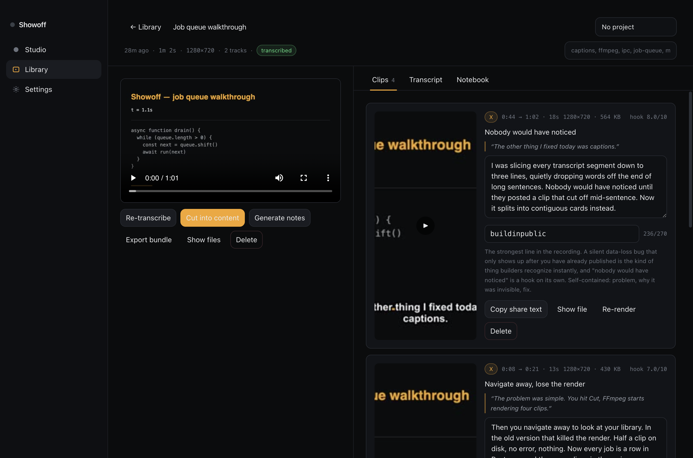
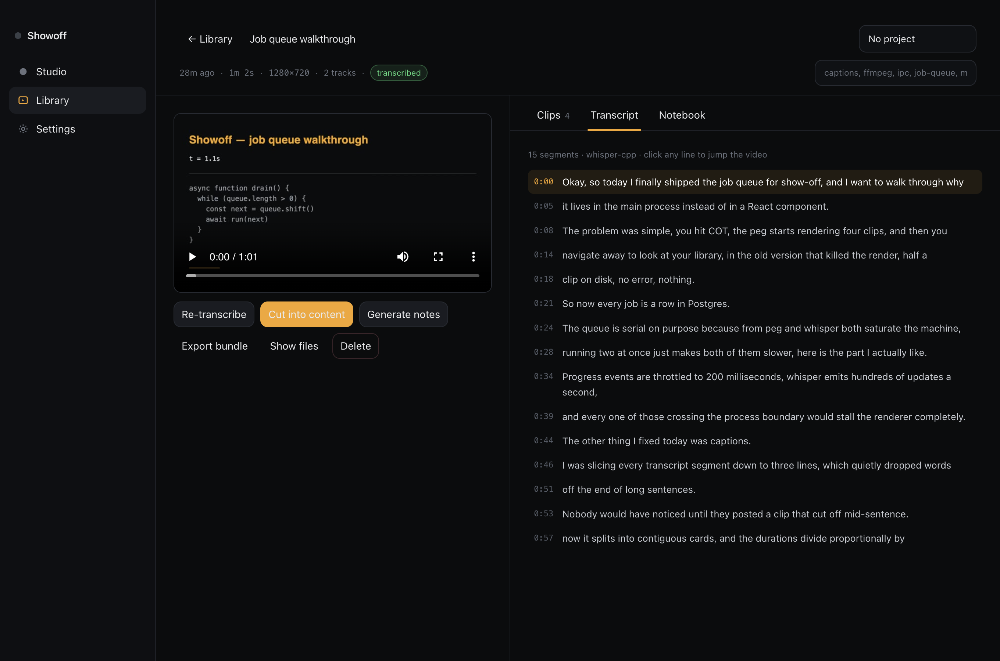
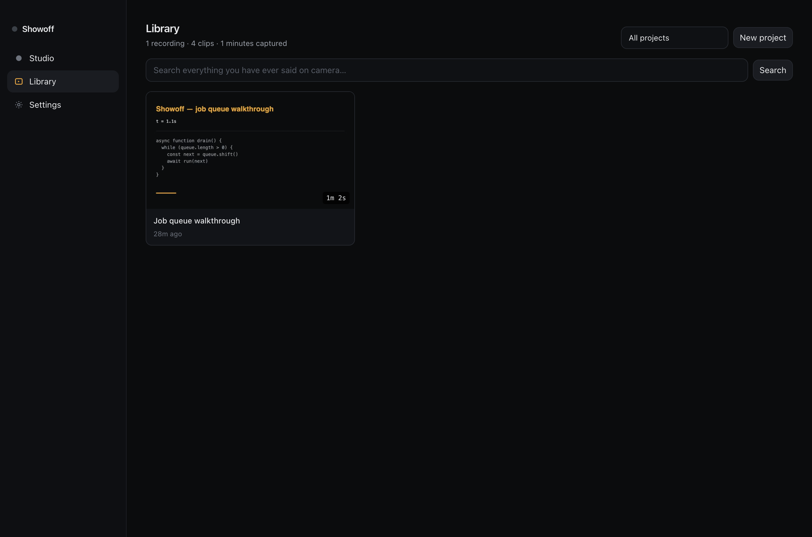

# Showoff

**A desktop studio for builders who want to ship one screen share a day.**

Record your screen, webcam, microphone and computer audio at once, then edit
what you captured: move the webcam where you want it, level or mute any track,
trim the ends, narrate over it, reframe for vertical, and export an mp4.

Every source is its own lane. Nothing is baked together at record time, so
there is no take you cannot take apart afterwards. Add another screen or
another camera to the same project later and it arrives as one more lane.

Transcribing, chopping into platform-shaped clips, burning in subtitles and
generating a post are all still here — but they are optional passes over a
recording you have already edited, not the pipeline you have to go through.



<p align="center">
  
  
</p>

---

## Download

Grab the latest build from **[Releases](https://github.com/rondorkerin/showoff/releases/latest)**.

| Platform | File |
| --- | --- |
| macOS (Apple silicon) | `Showoff-x.y.z-arm64.dmg` |
| macOS (Intel) | `Showoff-x.y.z-x64.dmg` |
| Windows (installer) | `Showoff-x.y.z-x64-setup.exe` |
| Windows (portable) | `Showoff-x.y.z-x64-portable.exe` |

### The builds are unsigned

Code signing certificates cost money that v1 does not have, so your OS will
complain the first time. This is expected and the workaround is one click.

**macOS** — after dragging Showoff to Applications:

```sh
xattr -dr com.apple.quarantine /Applications/Showoff.app
```

Or: right-click the app → **Open** → **Open** in the dialog.

**Windows** — SmartScreen will show "Windows protected your PC".
Click **More info** → **Run anyway**.

### macOS permissions

The first recording triggers two system prompts. Showoff cannot capture
anything until you grant them:

- **Screen & System Audio Recording** — for the screen or window you pick, and
  for computer audio, which goes through the same permission
- **Microphone** — for your voice
- **Camera** — only if you switch the webcam track on

If you deny Screen Recording, Studio shows an empty source list. Re-enable it
in **System Settings → Privacy & Security → Screen Recording**, then reopen
Showoff (macOS requires a restart of the app for this permission to take).

---

## What it does

**Record.** Screen, webcam, microphone and computer audio are captured as
separate files, streamed to disk as they arrive. A crash mid-recording leaves
playable files behind rather than a corrupt one. There is a countdown, a live
level meter, and a hint if your microphone has gone quiet for too long.

Computer audio — what the machine is playing — needs nothing installed on
either platform. Windows uses Electron's loopback capture. macOS 13 and newer
goes through ScreenCaptureKit, the same API OBS moved to in version 29, via a
small bundled helper; it rides on the screen-recording permission you have
already granted. On macOS 12, or if you would rather route audio yourself,
Showoff falls back to a virtual audio device and can `brew install
blackhole-2ch` for you.

**Edit.** The editor is a timeline of lanes, one per source, over a live
preview that composites exactly what the exporter will render.

- Drag a lane on the canvas to move it, or resize it with the Size slider.
  Position is remembered **per aspect ratio**, so framing for 9:16 leaves your
  16:9 layout alone.
- Drag a lane in the rail to slide it in time; drag its edges to trim. Arrow
  keys nudge, shift makes it a second.
- Every lane has a level, a mute, and a stacking order. Audio lanes can duck
  the others under them.
- Record a **voice-over** against the footage. It becomes a lane like any
  other — play it, level it, move it, duck the original under it, or delete it.
  No re-transcribe required.
- **Add source** records another screen, camera or audio track into a project
  that already exists.
- Choose an output shape — source, 16:9, 9:16, 1:1, 4:5 — and **Export mp4**.

**Transcribe.** *(Optional.)* `whisper.cpp` runs on your machine, and nothing leaves your
computer unless you explicitly point Showoff at Groq or OpenAI in Settings.
The ~140MB English model downloads once, on first use.

Getting `whisper.cpp` itself differs by platform, because upstream only
publishes ready-to-run binaries for some of them:

| Platform | How Showoff gets it |
| --- | --- |
| Windows, Linux | Downloaded automatically (~8MB) the first time you transcribe |
| macOS | `brew install whisper-cpp` — Settings → Models has a button that runs it, or run it yourself |

If you would rather not install anything, put a Groq or OpenAI API key in
Settings and transcription happens in the cloud instead. Settings → Models
always shows which one you are actually using.

**Ask.** *(Optional.)* Before cutting, Showoff reads the transcript and asks you three or
four questions it genuinely cannot answer on its own — what the product is
actually called, which of two fixes should lead, who you are posting for.
Answers go straight into the prompt. Skip any of them.

**Cut.** *(Optional.)* The model plans clips against real platform constraints (aspect ratio,
duration ceiling, character limits) and Showoff renders each one with ffmpeg:
letterboxed onto a blurred, darkened zoom of your own footage rather than black
bars, captions burned in from the transcript, webcam picture-in-picture if you
recorded one.

**Post.** *(Optional.)* Every clip has an editable description and hashtags, with a live
character count against the platform's limit. One button copies the exact text
to paste. **Export bundle** writes the mp4s, poster frames, share text, notes
and transcript into a folder.

**Remember.** Every recording, transcript, note and clip lands in an embedded
Postgres database with pgvector. Search combines full-text and semantic
matching, so "that thing I said about throttling IPC" finds the moment even if
you never used those words.

---

## Bring your own model

Showoff resolves the cheapest thing that already works, in order:

**Writing** — Claude CLI (no API key needed if you already use Claude Code) →
Anthropic API → OpenAI API → Ollama → any OpenAI-compatible endpoint.

**Transcription** — whisper.cpp (local) → Groq → OpenAI.

Settings → Models shows exactly what was found and what it is using. Every
prompt is editable in Settings → Prompts; the placeholders in braces are filled
in before sending.

---

## Build it yourself

Requires Node 22+.

```sh
npm install
npm run dev        # run against the vite dev server
npm run test       # unit tests (node --test)
npm run typecheck
npm run build      # compile main, preload and renderer
npm run pack:mac   # dmg + zip, arm64 and x64
npm run pack:win   # nsis + portable, x64
```

`ffmpeg` and `ffprobe` are bundled — there is nothing to install.

### Architecture

- **Electron 43** with `contextIsolation: true` and `nodeIntegration: false`.
  The renderer talks to the main process through a narrow typed preload bridge.
- **PGlite** — real upstream Postgres compiled to WASM, running in process.
  No server, no install, no Docker; migrations run at startup.
- Media files are served through a custom `showoff://` protocol scoped to the
  storage directory, so a compromised renderer cannot read arbitrary files.
- Jobs run in a serial queue in the main process and are persisted to a `jobs`
  table, so navigating away never cancels a render.

See [docs/ARCHITECTURE.md](docs/ARCHITECTURE.md) and
[docs/DESIGN.md](docs/DESIGN.md).

---

## Where your files live

| What | Where |
| --- | --- |
| Recordings, clips, bundles | `~/Movies/Showoff` (configurable in Settings) |
| Database, logs, whisper model and binary | app data dir (`~/Library/Application Support/showoff` on macOS) |

Deleting a recording in Showoff removes it from the library. **The files stay
on disk** — nothing here deletes your footage.

## Licence

MIT.
